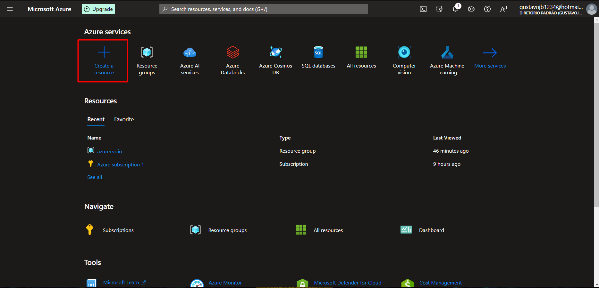
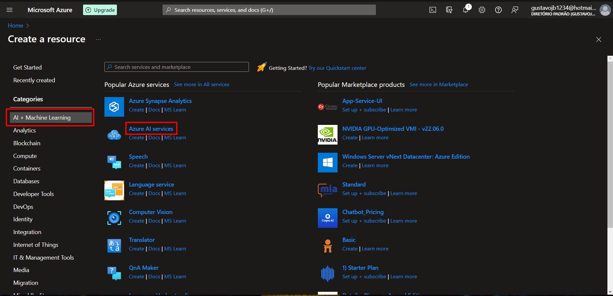
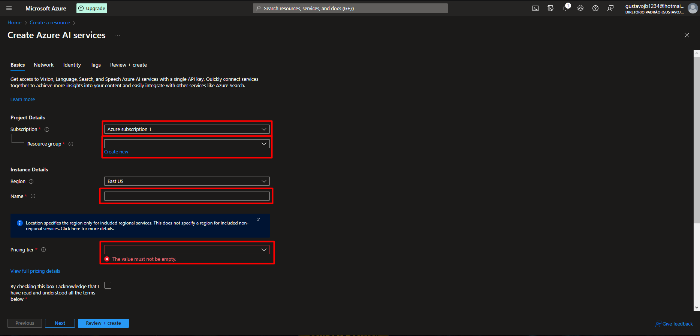
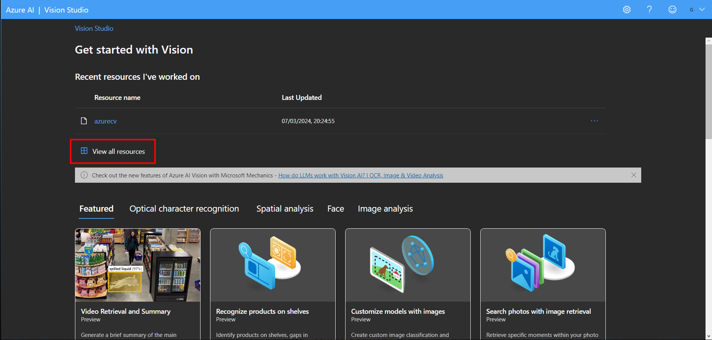
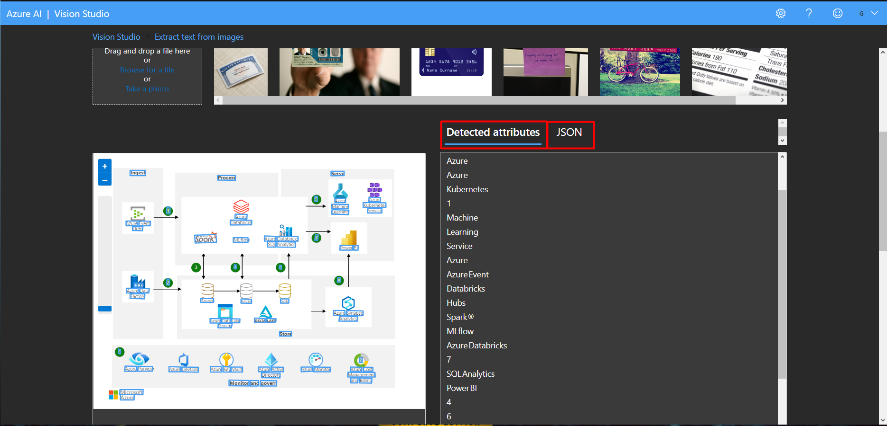

  

## Descrição do Projeto 📚

Este projeto utiliza a plataforma Vision Studio do Azure para identificação de texto em diferentes imagens.

## Conjunto de Dados 💾

O conjunto de dados utilizado neste projeto são imagens com texto retiradas da internet para aplicação da extração de textos com OCR no Vision Studio.

## Metodologia 📘

A primeira etapa do processo se trata de basicamente criar um novo **Resource** dentro do Microsoft Azure. Para isso, na página inicial do Azure, basta clicar em **"Create a Resource"**, como mostra a imagem 1:

  

Na próxima etapa, na parte esquerda da tela, basta marcar "AI + Machine Learning" para filtrar os recursos, e então clicar em "Azure AI Services", como mostra a imagem 2.

  

Logo após, basta criar a **Resource Group**, para isso basta escolher um tipo de subscrição, o nome dessa **Resource Group**, o nome da instancia para visão computacional a ser criada e o *tier pricing*, e então clicar em **review + create** conforme visto na imagem 3.

  

Com a **Resource Group** criada, a etapa final se trata de entrar na **Azure Vision Studio** através desse [link](https://portal.vision.cognitive.azure.com/gallery/featured), selecionar a **Resource Group** criada anteriormente e escolher um ou mais recursos para serem utilizados conforme sua necessidade. A imagem 4 mostra a **Dasboard** do Vision Studio.

  

Como um exemplo, foi utilizada uma imagem baixada da internet para demonstração da aplicação na imagem 5, onde o resultado pode ser tanto **Bounding Boxes** no texto da imagem, como também um arquivo .json com as coordenadas dessas **Bounding Boxes** na imagem:

  

## Repositório do Projeto

## Conclusão

Com esse projeto, foi possível explorar as diversas ferramentas de visão computacional do Microsoft Azure, especialmente o reconhecimento de rosto e o reconhecimento de caracteres (OCR).
